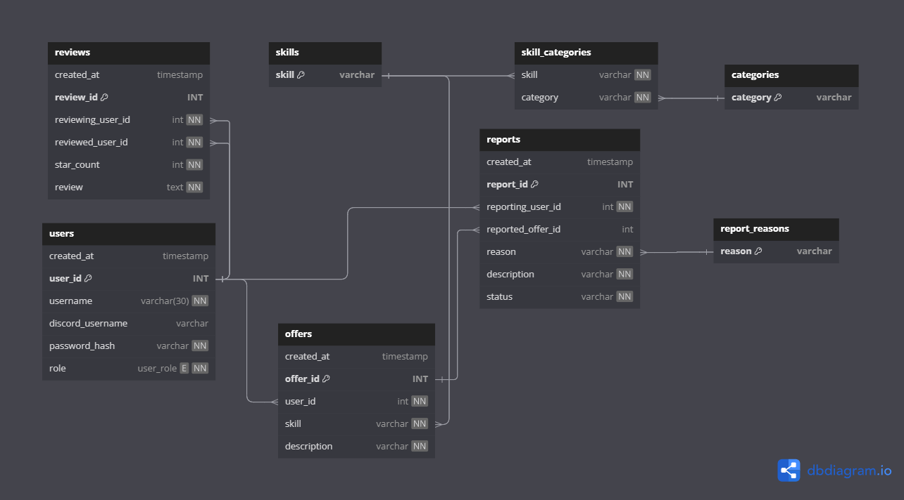
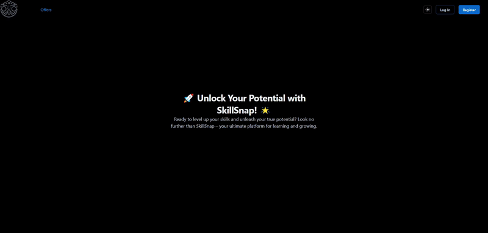
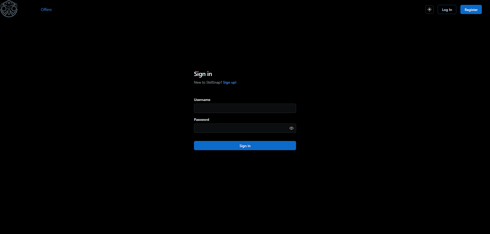
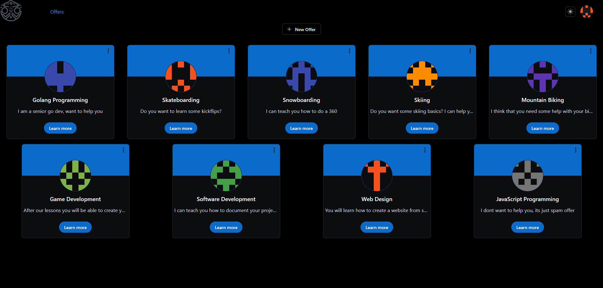
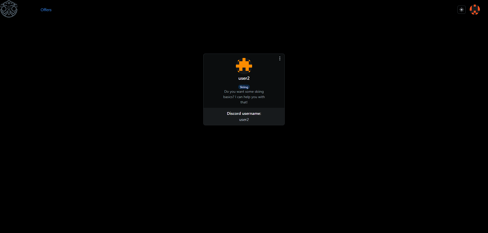
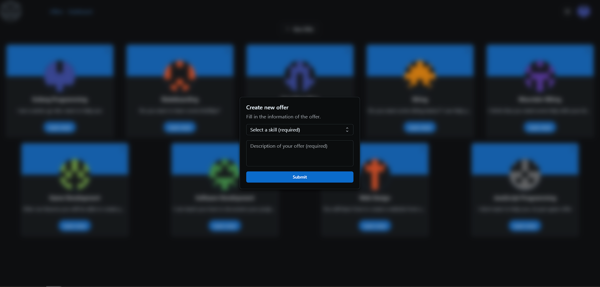
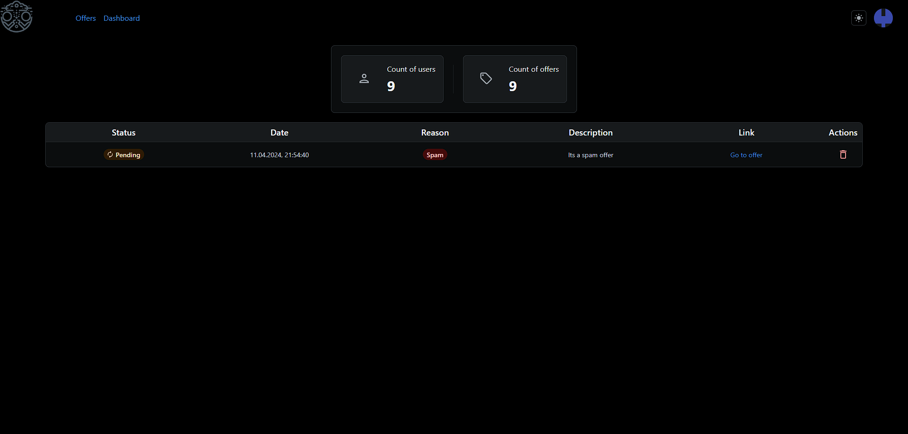
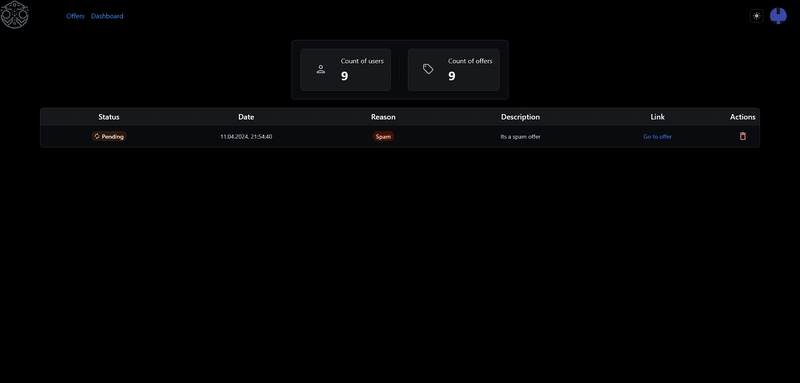

# SkillSnap

## Introduction
`SkillSnap` is a project made for the Introduction to Web Applications course at AGH UST. It showcases a concept for an online skill exchange platform and demonstrates CRUD operations on a PostgreSQL database, as well as user authentication and authorization. Moreover, it features a frontend made with React. To avoid writing Chat functionality (limited time), I have assumed that the users can communicate via Discord (of course it's not the best solution).

## Technologies
1. **Languages:**
   - Go
   - Typescript
   - SQL
   - Python (for API testing)
2. **Backend Libraries:**
   - sqlc
   - github.com/alexedwards/flow (HTTP router)
   - github.com/jackc/pgx (PostgreSQL driver)
3. **Frontend Libraries:**
   - React
   - TanStack Query
   - Formik
4. **Other:**
   - PostgreSQL
   - Docker
   - Docker Compose

## Database Schema
The database schema is quite simple. It consists of 8 tables:



## Frontend Screenshots
#### **Home Page (sped-up 3x):**



#### **Login Form:**



#### **Offers Page:**



#### **Offer Details:**



#### **New Offer Form:**



#### **Admin Dashboard:**



#### **Dark/Light Mode:**



## Run `SkillSnap` Locally
1. Make sure you have Docker, Docker Compose, NodeJS and vite installed on your machine.

2. Clone the repository:
    ```bash
    git clone https://github.com/Mateusz2734/skillsnap.git
    ```

3. Change the directory:
    ```bash
    cd skillsnap
    ```

4. Run the following command to start the backend:
    ```bash
    docker-compose up [-d]
    ```
    The -d flag is optional and it runs the containers in the background. 
    Backend should be now available at `http://localhost:4444`.

5. Change the directory to the frontend:
    ```bash
    cd frontend
    ```

6. Install the dependencies:
    ```bash
    npm install
    ```

7. Start the frontend:
    ```bash
    vite
    ```

8. Open your browser and go to `http://localhost:5173`.

9. You can use the following credentials to log in:
    - user:
        - username: user
        - password: user1234
    - admin:
        - username: admin
        - password: admin1234


## Future Improvements And Features
- Chat functionality
- More thorough testing
- All API endpoints used in the frontend
- New design of skills and categories database schema
- Database migrations

## License
`SkillSnap` is released under the MIT License. See the [LICENSE.md](LICENSE.md) file for more details.